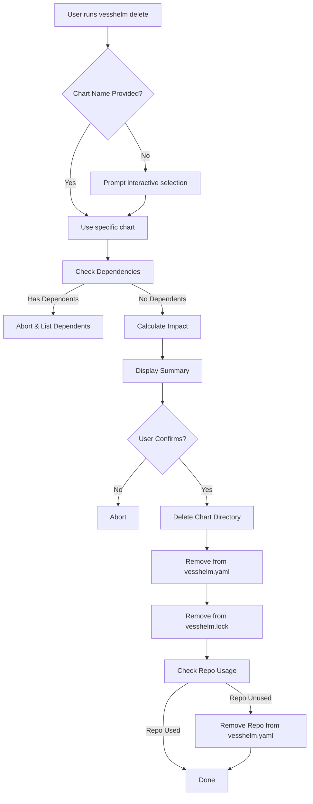

# Design: Chart Deletion

## Workflow

## Data Consistency

*   **Config (`vesshelm.yaml`)**: The source of truth for desired state. Removing the entry stops future syncs/deploys.
*   **Lockfile (`vesshelm.lock`)**: Reflects the current local state. Removing the entry keeps it consistent with `vesshelm.yaml`.
*   **Filesystem**: The actual chart files. Must be removed to reclaim space and avoid confusion.

## Logic Details

*   **Dependency Check**: Reuses `vesshelm::util::dag::get_dependents`. This returns a list of immediate dependents. Since we only delete one chart at a time, checking immediate dependents is sufficient to block the operation.
*   **Repository Cleanup**: Iterate through all *remaining* charts in the config. If `chart.repo_name` matches the deleted chart's repo, and no other chart uses it, mark it for deletion.
